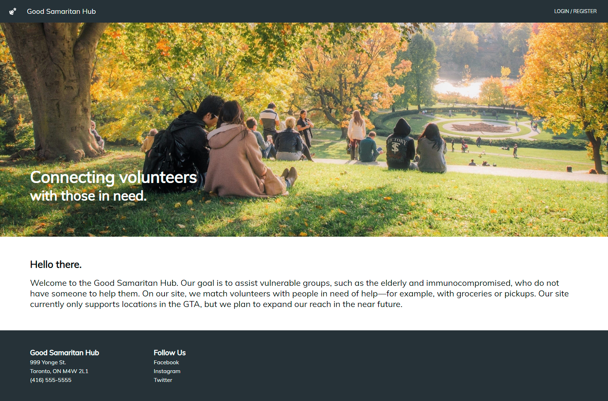
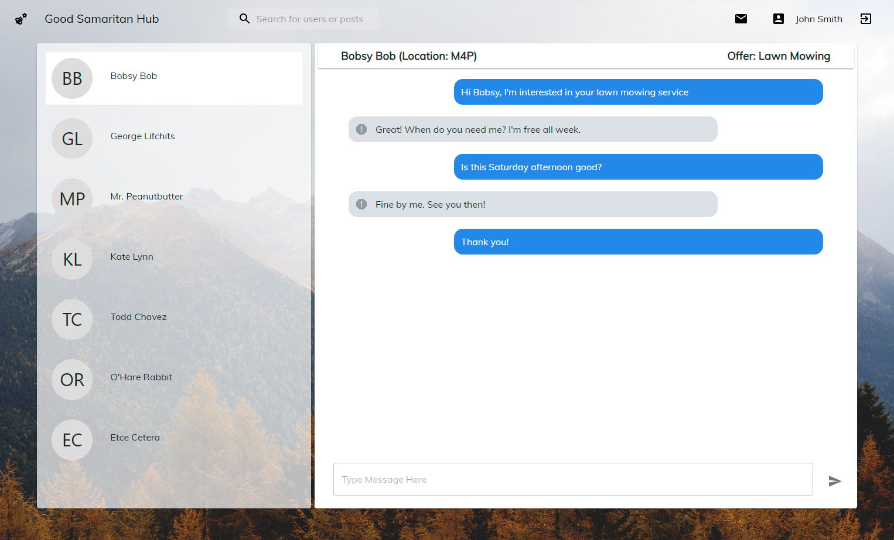

# The Good Samaritan Hub :seedling: - a MERN Stack App

## About
The Good Samaritan Hub is a web app that matches volunteers with people in need. Its front-end and back-end are implemented using MERN stack. It features user authentication and authorization in its API routes.

## Previews
| **Landing** |  **Home** | **Post Creation** |
|:-------------------------:|:-------------------------:|:-------------------------:|
| **Search Results** |  **Expanded Post** | **Inbox** <tr></tr>|
| **Profile** |  **Settings** | **Admin** |

## Deployed Demo
**https://hidden-fjord-63319.herokuapp.com/**

#### Login Credentials:
username: `user`  
password: `user`

## Instructions to Run Locally
Start a local Mongo database:
```
mkdir mongo-data
mongod --dbpath mongo-data
```

In a separate terminal, clone the git repo:  
```
git clone https://github.com/ashley-d-lu/Good-Samaritan-Hub.git
```

Navigate to the root directory of the repo and run:   
```
cd client && npm install && npm run build && cd ../server && npm install && npm start
```

Open `localhost:5000` in your browser.

## Instructions to Use
### User
#### Login Credentials*:
username: `user`  
password: `user`

*for the deployed demo. If you are running the app locally, you will need to register an account.

#### Features:

- The landing page (`/`) explains the purpose of the site. Its header contains a link to the login page and a link back to the landing page.
- On the login page (`/login`), existing users can enter their username and password to log in. Banned users are blocked from logging in. New users can create an account by clicking "Need to register?" (`/registration`). During registration, the user must enter a username that does not already exist and a password that is at least 8 characters.
- After logging in, the user is taken to the homepage (`/home`) where they can see a list of posts in the location they defined in their profile. They can filter posts by type and location, sort posts by date, and search for posts and users by title, username, first name, and last name. They can also create a post. In the header, there is a link to the homepage, a search box, a link to the user’s inbox, a link to the user’s profile, and a logout button.
    - The user can expand a post by clicking the arrow button. In the expanded view, the user can read the full description of the post, go back, or click on the poster’s name to view their profile. 
        - If the user is viewing their own post, they can remove it. Removed posts are permanently hidden from the public and can only be viewed by the poster on their profile.
        - If the user is viewing another user's post, they can report the post or send a message to the poster. Reported posts are permanently hidden from the reporter. 
    - Creating a new post will take the user to a screen where they can input a title, body, type of request, and location. When ready, the user can click "Post" to publish it.
    - When searching, if there are more than 6 users that match the search term, only 6 users are initially shown. The user can click the arrow button to show up to 6 more. (To try this in the deployed demo, search for "user").
- The inbox page (`/inbox`) allows the user to view their past messages and send new messages. The user can also report another user's message. The header of each conversation shows the latest request/offer involved (if any), the other user's location, and a link to the other user's profile.
- The profile page (`/profile`) allows the user to see a user’s information and posts.
    - If the user is viewing their own profile, they can edit their information by clicking "Edit".
    - If the user is viewing another user's profile, they can click "Message", which will start a new conversation or open the existing conversation.
- The setting page (`/setting`) allows the user to edit their information (which includes first name, last name, biography, and location) and their password.
    - The user must enter a non-empty first name, last name, and location.
    - When changing their password, the user must enter their current password and enter their new password two times. Their new password must be at least 8 characters.


### Admin

The admin login page is found at `/adminLogin`.

#### Login Credentials*:
username: `admin`  
password: `admin`  

*for the deployed demo. If you are running the app locally, you will need to insert an admin account into your Mongo database.

#### Features:
- After logging in the admin can see a list of all the users. The list is sorted with those having a report pending at the top to allow the admin to easily see them. 
- Clicking a user shows their complete information and post history, as well as any reports other users have made about them. The admin can look at the reports and either delete the report or ban the user with a ban reason. 
- The admin can also unban a previously banned user.

## API Routes
### Session Handling Routes
#### No authentication needed:

User Login: `POST "/users/login"`
- Expected request body:
    - `{ "username": String, "password": String }`
- Expected response:
    - If the User with the specified username and password exists:
`{ "currUser": (the currently logged in User's document), "admin": false }`
    - Status 401 if the password is incorrect
    - Status 400 if the request body form is invalid or if the user with the given username doesn't exist

User and Admin Logout: `GET "/users/logout"`
- Expected response: 
    - Status 200

Admin Login:  `POST "/admin/login"`
- Expected request body:
    - `{ "username": String, "password": String }`
- Expected response:
    - If the Admin with the specified username and password exists:
`{ "currUser": (the currently logged in Admin"s document), "admin": true }`
    - Status 401 if the password is incorrect
    - Status 400 if the request body form is invalid or if the Admin document with the given username doesn't exist

#### Only authorized for users and admins:

Check session: `GET "/users/check-session"`
- Expected response:
    - If there is currently an Admin logged in:
`{ "user": (the currently logged in Admin"s document), "admin": true }`
    - If there is currently a User logged in:
`{ "user": (the currently logged in User's document) }`
    - If there is no User or Admin logged in, status 401 unauthorized

### User Routes
#### No authentication needed:

Check if a username already exists:  `GET "/user/check-username/:username"`
- Expected response:
    - `{ "result": "Username does not exist"}` or `{ "result": "Username exists" }`

Create a user: `POST "/user"`
- Expected request body:
    - ```
    	{ 
			"username": String, 
			"password": String, 
			"firstName": String, 
			"lastName": String, 
			"location": String (Preferably a postal code, e.g. "M4V"),
			"phoneNum": String (optional),
			"email": String (optional),
			"bio": String (optional)
		}
- Expected response
    - If registration was successful, the newly created User document
    - If registration was unsuccessful (e.g. due to the request body being not well-formed), status 400


#### Only authorized for users and admins:

Get user by username: `GET "/user/username/:username"`
- Expected response:
    - Status 404 if the user doesn't exist
    - Otherwise, the user's basic profile information:
`{ 
	"username": String, 
	"firstName": String, 
	"lastName": String, 
	"location": String, 
	"bio": String 
}`

Get all non-banned users who username or full name contains a search term: `GET "/user/searchTerm/:searchTerm"`
- Expected response:
    - A list of all matching, non-banned users (showing just their basic profile information)

Update a user: `PATCH "/user/username/:username"`
- Expected request body:
    - A list of changes to make to the user: [ { "op": "replace", "path": `<path>`, "value": `<value>` } ... ]
    - For convenience, here is a list of all possible values for `<path>` and types for `<value>`
		- ```
			[ 
				{ "op": "replace", "path": "/isBanned", "value": Boolean },
				{ "op": "replace", "path": "/isReported", "value": Boolean },
				{ "op": "replace", "path": "/banReason", "value": String },
				{ "op": "replace", "path": "/firstName", "value": String },
				{ "op": "replace", "path": "/lastName", "value": String },
				{ "op": "replace", "path": "/bio", "value": String },
				{ "op": "replace", "path": "/location", "value": String },
				{ "op": "replace", "path": "/postsHiddenFromUser", "value": List[ObjectId] }
			]
- Additional notes on authorization:
    - Admins are only allowed to change `/isBanned`, `/isReported`, and `/banReason`.
    - Users are only allowed to change:
`/firstName`, `/lastName`, `/bio`, `/location`, and `/postsHiddenFromUser`, if they are updating themself
`/isReported` to true if they are updating another user
- Expected response:
    - If the current user or admin is not authorized to change `<path>`, status 401 is sent
    - Otherwise:
        - for an admin, or a user updating themself, the entire User document for the updated user is sent
        - for a user updating another user, the updated user's basic profile information and isReported property are sent

Update password: `PATCH "/user/username/:username/:password"`
- Expected request body:
    - [ { "op": "replace", "path": "/password" , "value": `<newPassword>` } ]
- Expected response:
    - If req.session.username !== req.params.username, status 401 is sent
    - If the old password (req.params.password) is incorrect, status 401 is sent
    - Otherwise, the updated User document is sent

#### Only authorized for admins:

Get all users: `GET "/users"`
- Expected response:
    - A list of all User documents (without their password, email, and postsHiddenFromUser properties):
        - ```
            [
                {
                    "_id":  Object,
                    "bio": String,
                    "isReported": Boolean,
                    "isBanned": Boolean,
                    "banReason": String,
                    "username": String,
                    "firstName": String,
                    "lastName": String,
                    "location": String,
                    "conversations": [
                        {
                            "_id": Object,
                            "username": String,
                            "lastMessageTime": Date,
                            "post": Object,
                        },
                        …
                    ]
                },
                …
            ]
### Post Routes
#### Only authorized for users:

Create a post: `POST "/post/:posterUsername"`
- Additional notes on authorization:
    - This route is only authorized if req.session.username === req.params.posterUsername
- Expected request body:
    - ```
    	{ 
			"title": String, 
			"body": String, 
			"type": "Request" or "Offer", 
			"date":  Any valid date string (e.g. "July 17, 2020 03:24:00"), 
			"status": "active" or "inactive", 
			"location": String (Preferably a postal code, e.g. "M4V")
		}
- Expected response
    - Status 401 if req.session.username !== req.params.posterUsername
    - Otherwise, the newly created post

#### Only authorized for users and admins:

Get all posts in a location: `GET "/post/location/:location"`
- Expected Response:
    - For admins, this route sends all posts in the specified location
    - For regular users, this route filters out the following posts:
        - "inactive" posts that were not posted by the current user
        - posts made by banned users

Get all posts from a user: `GET "/post/posterUsername/:posterUsername"`
- Expected Response:
    - For admins, this route sends all posts posted by the specified user
    - For regular users,  this route filters out the following posts:
        - "inactive" posts that were not posted by the current user
        - posts made by banned users

Update a post by post id: `PATCH "/post/:id"`
- Expected request body:
    - A list of changes to make to the post:
[ { "op": "replace", "path": `<path>`, "value": `<value>` } ... ]
    - For convenience, here is a list of all possible values for `<path>` and types for `<value>`:
	- ```
		[ 
			{ "op": "replace", "path": "/isReported", "value": Boolean }, 
			{ "op": "replace", "path": "/status", "value": "active" or "inactive" }
		]
- Additional notes on authorization:
    - Admins are allowed to change `/isReported`
    - Users are only allowed to change `/isReported` to false
    - Users are only allowed to change `/status` if it's their own post
- Expected response:
    - If the current user or admin is not authorized to change `<path>`, status 401 is sent. 
    - Otherwise, the updated post is sent.

### Message Routes
Stores all the messages in the following format:
`{ messageSender: String, messageReceiver: String, date: Date, messageContent: String, isReported: Boolean }`

#### Only authorized for users:

Send a message: `POST"/messages"`
- Expected Body:
    - `{ "messageSender": String, "messageReceiver": String, "messageContent": String }`
- Additional notes on authorization:
    - The current user must be the messageSender
- Expected Response
    - The newly created Message document
    - 401 Unauthorized if the current user is not the messageSender

#### Only authorized for users and admins:

Get messages that involve a specific user: `GET"/messages/:username"`
- Additional notes on authorization:
    - Users can only get messages that they"ve sent or received
    - Admins can get any users messages
- Expected Response:  
    - List with all messages involving the user
`[{"messageSender":String, "messageReceiver":String, "messageContent": String} ... ]`
    - 401 Unauthorized if a user tries getting another user's messages

Update a message's report status: `PATCH "/messages/:id"`
- Additional notes on authorization:
    - Users can only update a message"s reported status if they are the ones who received it
    - Admin can update any message"s reported status
- Expected Body:
    - `[{ "op": "replace", "path": "/isReported", "value": Boolean}]`
- Expected Response:
    - The updated Message document
    - 401 Unauthorized if the user is not allowed to report this message

#### Only authorized for admins:

Get all messages: `GET "/messages"`
- Expected Response:  
    - List with all the messages
`[{"messageSender": String,"messageReceiver": String,"messageContent": String} ... ]`

### Conversation Routes
Stores a list of users a user has messaged along with the time of the last message, and the post related to that conversation

#### Only authorized for users and admins:

Get a conversation for a single user: `GET "/conversations/:username"`
- Additional notes on authorization:
    - Users can only access their own conversations
    - Admins can access any conversations
- Expected Response:
    - `[{username: String, lastMessageTime: Date, post: ObjectID} ...]`
    - 401 Unauthorized if the sender is not the admin or the user with the given username

Creates a conversation: `POST "/conversations/:username"`
- Updates the conservation of the user with the given username and the user being messaged
- Expected Body: 
    - `{ "messagedUser": String }`
- Expected Response: 
    - The updated Conversation document
    - 401 Unauthorized if the sender is not the admin or the user with the given username

Update a conversation: `PUT "/conversations/:username"`
- Expected Body: 
    - `{ "messagedUser": String, "Post": ObjectID }`
- Expected Response:
    - 200 if the conversation successfully updated
    - 401 Unauthorized if the sender is not the admin or the user with the given username

### Location Routes

#### No authentication needed:

Get all locations:  `GET "/locations"`
- Expected response:
    - A list of all Location documents

#### Only authorized for admins:

Add a location: `POST "/location"`
- Expected request body:
    - `{ "postalCode": String, "lat": Number, "lon": Number }`
- Expected response:
    - The newly added Location document
